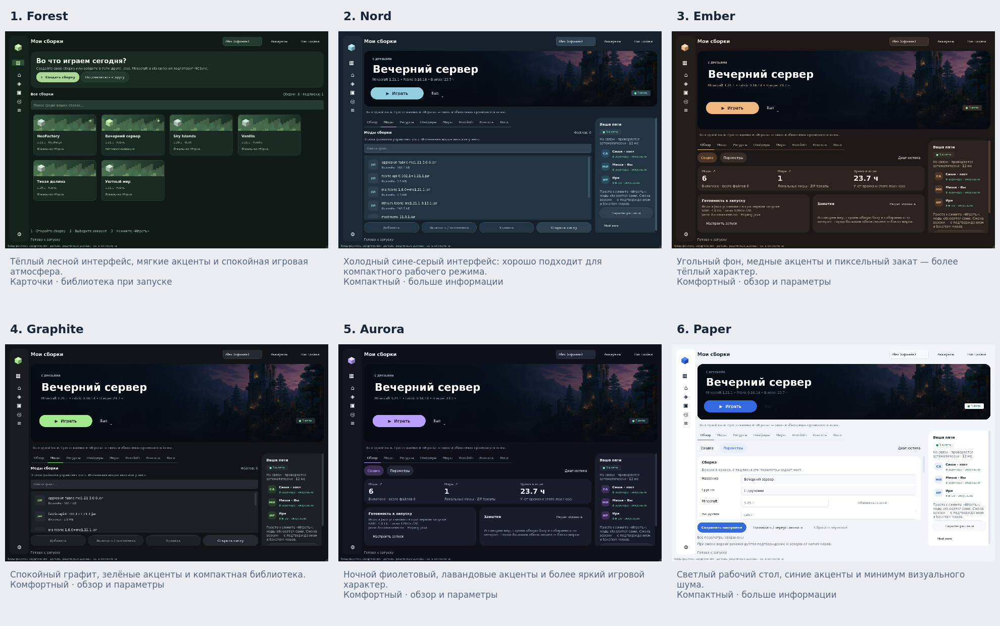

# SYNCMC / MCSync

Независимый **Minecraft Java Edition** лаунчер на Python + PySide6 с синхронизацией сборок между друзьями. Хост меняет моды, Minecraft или загрузчик; друзья получают обновления при запуске. По умолчанию смена версии требует подтверждения и сопровождается резервной копией миров.

Это новая реализация по описанию проекта, **не форк PolyMC/Prism** и не восстановление недоступного кода из другого чата. Приложение целиком находится в **`mcsync.py`**. Название/иконка собственные. Версия **0.4.0** — предварительная: перед использованием на важных мирах сохраните отдельную копию.

## Готовые архивы

**[Релиз MCSync 0.4.0 — Aurora](https://github.com/Evizka/SYNCMC/releases/tag/v0.4.0)** — прямые архивы без дополнительной ZIP-обёртки:

| Система | Скачать | Запустить после распаковки |
| --- | --- | --- |
| Windows 10/11, x64 | [MCSync-windows-x64.zip](https://github.com/Evizka/SYNCMC/releases/download/v0.4.0/MCSync-windows-x64.zip) | `MCSync/MCSync.exe` |
| Linux, x64 | [MCSync-linux-x64.zip](https://github.com/Evizka/SYNCMC/releases/download/v0.4.0/MCSync-linux-x64.zip) | `MCSync/MCSync` |
| macOS, Apple Silicon | [MCSync-macos-arm64.zip](https://github.com/Evizka/SYNCMC/releases/download/v0.4.0/MCSync-macos-arm64.zip) | `MCSync.app` |

**Распакуйте архив целиком.** Не переносите `.exe` отдельно от `_internal`. Python устанавливать не нужно. Java и Minecraft скачиваются при первом запуске игры. Рядом с архивами на странице релиза находятся `.sha256` и ZIP исходников.

Архивы не содержат саму игру, аккаунты и сборки пользователей. Исполняемые файлы не подписаны сертификатом; Windows SmartScreen/macOS Gatekeeper могут показывать предупреждение. Сверяйте SHA-256 и скачивайте только из своего доверенного репозитория.

Свежие проверочные сборки доступны в [GitHub Actions](https://github.com/Evizka/SYNCMC/actions/workflows/build.yml) → успешный запуск **Test and build MCSync** → **Artifacts**. У Actions artifact есть дополнительная ZIP-обёртка: сначала извлеките из неё нативный `MCSync-…zip`, затем распакуйте его целиком. Для обычного скачивания используйте релиз выше.

Краткая инструкция: [QUICKSTART_RU.md](QUICKSTART_RU.md).

## Возможности

- Создание, независимое копирование, удаление, поиск и группы сборок; избранное, сортировка по названию/последнему запуску, заметки и время в игре. Библиотека карточек и обзор с реальными счётчиками.
- **Vanilla, Fabric, Quilt, Forge, NeoForge** через `minecraft-launcher-lib 8.0`. При установке/раздаче «авто» закрепляется в конкретную версию. Кнопка «Совместимые версии» запрашивает список для выбранного Minecraft. NeoForge поддерживается для версий из актуального API `net.neoforged/neoforge` (обычно Minecraft 1.20.2+); старый NeoForge 1.20.1 в namespace `forge` не реализован.
- Mojang Java автоматически, выбор своего executable, поиск системной Java, RAM, JVM-аргументы, размер окна, автовход на сервер, локальные pre/post-команды.
- Моды, ресурспаки и шейдеры: добавление/drag & drop, поиск в списке, атомарное переключение `.disabled`, удаление; миры: импорт папки/ZIP и ZIP-бэкапы.
- Modrinth: поиск со страницами по 30 результатов, установка последней совместимой версии и **обязательных** зависимостей, закреплённые зависимости, обновление известных проектов, установка `.mrpack` в новую сборку. Обновление не распознаёт вручную добавленные JAR автоматически.
- Импорт `.mrpack`, ZIP MCSync и ZIP PolyMC/Prism (`mmc-pack.json`). Экспорт ZIP и `.mrpack` с локальными файлами в `overrides`; миры включаются по выбору. Проверяйте право распространять моды/ресурсы перед экспортом.
- Офлайн и Microsoft device-code аккаунты. Предпросмотр PNG-скинов 64×64/64×32, Classic/Slim; загрузка опубликованного скина Microsoft. **Локальный PNG не подменяет скин в игре**, загрузка нового скина на сервер Mojang не реализована.
- Консоль, `latest.log`, crash-reports и журнал запуска с ротацией; остановка дерева процессов игры/локальной команды. Диагностика и восстановление повреждённых настроек/аккаунтов без потери оригинала.
- Встроенная HTTP-раздача, исключения fnmatch, строгий режим модов, ручная синхронизация и пати с фоновыми проверками каждые 10 секунд и автоматическим переподключением, включая время игры.

## Новый экран в стиле cinematic / 0.4.0

- Крупный локальный фон мира, большой заголовок выбранной сборки и узкая панель иконок — композиция по вашему визуальному ориентиру, без копирования MISTY-брендинга.
- **Все кнопки-капсулы:** основной экран, меню действий, настройки и стандартные кнопки Qt-диалогов.
- Заметное движение: блик/подсветка при наведении (260 мс), затемнение нажатия и появление страниц/сборки (360 мс). Цель клика не перемещается; «Уменьшить анимации» сохранена.
- Список/фильтры раскрываются кнопкой «≡», поиск остаётся в библиотеке и доступен по Ctrl+F. Пати справа прокручивается, не накладывая кнопки/текст друг на друга.
- [GIF настоящих анимаций Qt](designs/motion.gif) и [новый экран](designs/aurora.png). GIF использует временную офлайн-демонстрацию, не запускает игру.


- Подключение объясняет причину ошибки: сеть, таймаут, занятый хост или недействительное приглашение. Обратный отсчёт показывает реальное время следующей автоматической попытки.
- «Помощь со связью» ведёт по трём понятным шагам. Новое приглашение заменяется **в существующей сборке**: миры/версии не сбрасываются; смена версии по-прежнему потребует подтверждения перед игрой.
- В приглашении хоста папки/правила свёрнуты; секретная ссылка скрыта до «Показать». Повреждённые настройки пати не роняют окно и сохраняются в приватный recovery перед созданием новых.
- Счётчики «Моды ↗» / «Миры ↗» открывают нужную вкладку мышью или Enter/пробелом. Фоновые проверки не сбрасывают черновик.
- Удаление или отключение недоступной комнаты не задерживает heartbeat к остальным пати; старые ответы от другой ссылки не рисуют ложный онлайн.

## Пати: подключились один раз — дальше автоматически

**У хоста:** «Пригласить друзей» → выбрать доступный друзьям LAN/VPN-адрес → «Создать пати» → «Скопировать приглашение».
Оставьте включённым «Восстанавливать пати при следующем открытии MCSync»: порт и секретная ссылка сохранятся.
Закрытие окна приглашения не останавливает сервер. Кнопка «Остановить» выключает его и автовосстановление.
Старые раздачи 0.2.0 не запускаются автоматически без вашего выбора этой опции.

**У друга:** «Подключиться по ссылке» → вставить приглашение один раз → подтвердить доверие хосту.
Сборка и ссылка остаются в библиотеке; после рестарта, обрыва сети или возвращения хоста связь восстановится сама.
Повторная вставка того же приглашения откроет существующую сборку вместо дубликата.

В постоянной панели пати справа видно **реальных участников** и состояния «В лаунчере / Обновляется / В игре», последнюю
синхронизацию и время ответа. Heartbeat идёт каждые 10 секунд; при ошибке задержка повторов растёт до 30 секунд.
Отсутствующий участник исчезнет через 45 секунд. При потере связи список не выдаётся за текущий онлайн.
Нажимать «Проверить» каждый раз не нужно — нажмите **«Играть»**, моды обновятся перед запуском.
Подтверждение смены Minecraft/загрузчика и бэкап миров по умолчанию сохраняются.

Имя в пати выбирается отдельно в **Настройки → Ваше имя в пати** или при первом входе.
Если оставить пустым, используется нейтральный «Игрок XXXX», не ник аккаунта/имя компьютера.
Идентификатор комнаты и приватная сессия хранятся в ваших настройках, в экспорт сборки не попадают.
У хоста список только в памяти: без IP, путей, аккаунтов или токенов участников.
Статус «актуально» отражает ревизию последней синхронизации; файлы дополнительно проверяются перед игрой.

**Это не облачный сервис и не автоматический обход NAT.** Хосту нужен открытый MCSync,
а друзьям — доступ к его LAN/VPN-адресу и HTTP-порту. Для другой сети используйте VPN/настройку доступа;
постоянный VPN/DNS-адрес удобнее изменяющегося LAN-IP. Хост 0.2.0 поддерживает автоматическую
проверку связи и модов, но для списка пати обновите и его до 0.4.0+.

## Оформление и удобство

Aurora теперь сочетает спокойные тёмные слои, пиксельный ночной пейзаж и лавандовую кнопку «Играть».
Пати остаётся справа при работе с модами, мирами и консолью. Фильтры/сортировка доступны через
«Фильтры и порядок», не занимая экран постоянно. Переходы и hover плавные; в настройках
можно включить **«Уменьшить анимации и переходы»**. Анимации не меняют выбранную сборку,
доступность кнопок или черновики.

В **Настройки → Оформление** доступны шесть тем, без перезапуска:

- **Aurora** — ночной фиолетовый / лаванда, выбранная основная тема для новой установки;
- **Forest** — лесной / шалфей;
- **Nord** — северный / ледяной;
- **Ember** — угольный / медный;
- **Graphite** и **Paper** — графитовая и светлая темы.

У существующего пользователя сохранённая тема не сбрасывается. Отдельно выбирается
**Интерфейс**: комфортный обзор, компактные списки или библиотека карточек при старте.
Все режимы содержат те же функции; к карточкам можно перейти кнопкой «Все сборки».



[Полноразмерные изображения](designs/README.md) · [Три компоновки](designs/layouts.png).
Это реальный PySide6-интерфейс с временными демонстрационными данными, а не макет сайта.
Пиксельные иллюстрации нарисованы программой; чужие ассеты не включены.

Обзор показывает реальные моды, миры, время и состояние установки; «Параметры» открывают
редактор. **Черновик сохраняется отдельно** при вводе, смене сборки, фильтре и закрытии.
Имя, заметки, RAM и даже выбранная версия восстанавливаются после перезапуска, но
**не применяются**, пока не нажата кнопка «Сохранить». Смена версии по-прежнему требует
подтверждения/бэкапа; поля версии подписки контролирует хост. «Сбросить черновик»
возвращает реальные параметры. Черновики не экспортируются и не синхронизируются.

Горячие клавиши: **Ctrl+S** — сохранить, **Ctrl+F** — поиск, **Ctrl+N** — новая сборка,
**Ctrl+Enter** — запустить, **Ctrl+L** — карточки, **Ctrl+,** — параметры, **F1** — диагностика.
На macOS вместо Ctrl используется Cmd.

Для временного просмотра без сохранения оформления:

```bash
python mcsync.py --theme nord --layout compact
```

## Исправление ошибки `has no attribute 'mod_loader'`

Общий API `minecraft_launcher_lib.mod_loader` появился в **8.0**. В старой библиотеке его нет;
также подмодули могут потеряться при упаковке динамических импортов в PyInstaller.

Начиная с 0.1.1 подмодули импортируются явно, все они включаются в нативный архив, а запуск
проверяет API Fabric/Quilt/Forge/NeoForge **без сетевых запросов**. Та же проверка выполняется
при smoke-test упакованного `.exe`, поэтому простого успешного открытия окна для CI уже недостаточно.
Отсутствие API даёт понятную инструкцию, а не `AttributeError`, и не меняет сборку.

- **Исходники:** из того же Python/venv, которым запускаете лаунчер, выполните
  `python -m pip install --upgrade -r requirements.txt`.
- **Готовый `.exe`:** скачайте новый архив **0.4.0** из [релиза](https://github.com/Evizka/SYNCMC/releases/tag/v0.4.0) и распакуйте его целиком.
  Не заменяйте один `.exe`, оставляя `_internal` от старой версии; `pip install` не меняет упакованное приложение.
  Ваши сборки и миры по умолчанию хранятся отдельно, в каталоге данных. Для portable-режима сначала
  сохраните копию `data` и `portable.txt`, затем перенесите их в новый каталог приложения.

## Запуск из исходников

Требуется Python **3.11+**, Windows 10/11, Linux с glibc 2.34+ или поддерживаемая Qt macOS.

### Windows (PowerShell)

```powershell
py -3.11 -m venv .venv
.\.venv\Scripts\python.exe -m pip install -r requirements.txt
.\.venv\Scripts\python.exe mcsync.py
```

### Linux / macOS

```bash
python3 -m venv .venv
.venv/bin/python -m pip install -r requirements.txt
.venv/bin/python mcsync.py
```

Для Debian/Ubuntu установите системные библиотеки Qt, если их нет:

```bash
sudo apt-get update
sudo apt-get install libgl1 libegl1 libxkbcommon0 libdbus-1-3 libfontconfig1 \
  libxcb-cursor0 libxcb-xinerama0 libxcb-xkb1 libxkbcommon-x11-0 \
  libxcb-image0 libxcb-keysyms1 libxcb-render-util0
```

Для обычного запуска нужен графический сеанс. Для headless-проверки:

```bash
QT_QPA_PLATFORM=offscreen .venv/bin/python mcsync.py --smoke-test --data-dir test-output/smoke
```

`--version` выводит версию; `--data-dir ПУТЬ` или `MCSYNC_HOME` меняют каталог данных. Для portable-режима Windows/Linux создайте пустой `portable.txt` **рядом с executable**: данные окажутся в соседней папке `data`. Для macOS проще использовать `--data-dir`, не изменяя содержимое подписываемого `.app`.

## Как пользоваться синхронизацией

### Хост

1. Создайте локальную сборку, выберите Minecraft и загрузчик; добавьте моды/конфиги.
2. Для смены Minecraft/загрузчика обновите совместимые версии и сохраните настройки. Проверяйте совместимость модов сами — синхронизация не умеет автоматически исправлять несовместимый набор.
3. Нажмите **«Пригласить друзей»**. Выберите IP/DNS, порт (по умолчанию 25589), папки, исключения и строгий режим.
4. Запустите раздачу и приватно отправьте ссылку друзьям. Лаунчер слушает `0.0.0.0`; указанное поле IP влияет на ссылку, а не на bind.
5. Оставьте лаунчер открытым. Окно раздачи можно закрыть; сервер продолжит работу. Токен сохраняется в `host_settings.json`, поэтому ссылка сохраняется после перезапуска раздачи с тем же адресом/портом.

В одной LAN используйте LAN-адрес. Через интернет необходимы VPN/оверлей (Tailscale, Radmin и т. п.) или ручная настройка сети/брандмауэра. **Проброс порта и обход NAT не выполняются автоматически.** Доступ к серверу игры и доступ к HTTP-порту синхронизации — разные вещи.

### Друг

1. Нажмите **«Подключиться по ссылке»** и подтвердите доверие хосту (JAR — исполняемый код).
2. Первая установка выполняется без дополнительного диалога изменений. Если скачивание прервалось, подписка остаётся в списке — повторите «Синхронизировать».
3. Добавьте аккаунт, нажмите **«Играть»**. Сначала синхронизация, затем установка нужных Minecraft/загрузчика/Java, затем игра.
4. По умолчанию при смене версии откроется diff: Minecraft/загрузчик/сервер, скачать/заменить/удалить, объём и бэкап `saves`. Отмена **отменяет и запуск**, ничего не применяя.

Режимы в обзоре:

| Режим | Подтверждение |
|---|---|
| `ask` | Любые изменения файлов/версии/сервера |
| `version` (по умолчанию) | Только смена Minecraft или загрузчика/его версии |
| `auto` | Без диалога, включая версии; при включении есть отдельное предупреждение |

В `auto` бэкап миров при смене версий включён. В диалоге других режимов его можно отключить. Понижение релизной версии отмечается предупреждением; совместимость миров при любых переходах не гарантируется. У подписки заблокированы поля версии/сервера и редактирование состава модов в GUI. Java/RAM/окно/локальные команды/заметки доступны. «Отсоединить от хоста» оставляет файлы и делает сборку локальной.

### Правила файлов и сбои

- Моды всегда приводятся к содержимому хоста, включая `.disabled`.
- Конфиг заменяется, если **хост изменил его SHA-1** с предыдущей синхронизации или локального файла нет. Локальные настройки сохраняются, если хост не менял конфиг.
- Файлы, удалённые хостом из ранее синхронизированного набора, удаляются у друга.
- `strict` дополнительно удаляет лишние `.jar` и `.jar.disabled` в `mods`, включая подпапки. Другие пользовательские файлы не чистятся.
- Сначала все скачивания в staging/`.part`, проверка размеров и SHA-1, затем бэкап миров, затем транзакционное применение файлов/метаданных. Ошибка до применения не меняет сборку; ошибка применения вызывает откат. Журнал позволяет восстановить незавершённую транзакцию при следующем старте. Если файлы изменены после сбоя, восстановление останавливается вместо молчаливого удаления ваших правок.
- План изменений только читает диск. Если файл изменился после построения плана/подтверждения, операция прерывается и требует новой проверки.
- При недоступном хосте используется кеш манифеста и можно запустить **последнюю уже установленную** сборку. Кеш не содержит JAR и не используется для удаления или смены версии офлайн. Первая установка без хоста невозможна. Явная синхронизация с недостающими файлами выдаст ошибку.
- Ошибка токена/HTTP 403 не маскируется офлайн-кешем. При изменении файла на хосте во время скачивания ответ 412/ошибка хеша требует повторной синхронизации.

Бэкапы хранятся в `instances/<id>/backups`. Для восстановления остановите игру и распакуйте нужные файлы из ZIP в `game/saves`. **Удаление сборки удаляет и её локальные бэкапы** — экспортируйте важные данные наружу.

## Аккаунты Microsoft

В настройках укажите **свой Azure Application (Client) ID**. Нужны public client/device code flow, поддержка личных Microsoft-аккаунтов и одобрение Minecraft/Mojang: [aka.ms/AppRegInfo](https://aka.ms/AppRegInfo). Чужие Client ID не поставляются; Client Secret не нужен.

Окно покажет код и официальный адрес Microsoft. Пароль вводится **только в браузере Microsoft**. После входа выполняется Xbox Live → XSTS → Minecraft, профиль/Java-лицензия должны быть доступны. Refresh token обновляется при необходимости. Без настроенного/одобренного приложения онлайн-вход не будет работать. Офлайн-аккаунты не проходят авторизацию на `online-mode=true` серверах и не заменяют покупку Minecraft.

## Хранение и безопасность

По умолчанию:

- Windows: `%APPDATA%\MCSync`;
- Linux: `$XDG_DATA_HOME/mcsync` или `~/.local/share/mcsync`;
- macOS: `~/Library/Application Support/MCSync`.

```text
accounts.json                   # токены, не включать в Git/архивы
settings.json
recovery/                       # приватные копии повреждённых settings/accounts
launcher.lock                   # защита от двух лаунчеров с одной папкой
minecraft/                      # общие versions, assets, libraries, Mojang runtime
instances/<случайный-id>/
  instance.json                 # локальные параметры, приватная sync_url
  draft.json                    # приватный черновик, НЕ применённые параметры
  game/                         # отдельный gameDirectory
  sync_state.json               # путь → последний SHA-1 хоста
  manifest_cache.json           # кеш, привязанный к хешу точной ссылки
  host_settings.json            # секретный токен раздачи
  installed.json
  modrinth.json
  backups/
  launcher.log                  # максимум 8 МБ + две прошлые части
mcsync.log                      # ошибки самого лаунчера
```

**HTTP не шифрует трафик.** Токен защищает чтение, но это не шифрование и не подпись модов. Ссылка — bearer credential. Не публикуйте её, используйте доверенную LAN/VPN; HTTPS возможен через внешний reverse proxy, встроенного TLS-сервера нет. Хост не принимает загрузку/удаление файлов от клиентов; ограниченные POST разрешены только для временного присутствия в пати. Раздаются только allowlist-пути `mods/config/resourcepacks/shaderpacks`; миры, аккаунты, команды и локальная Java не синхронизируются. Избегайте паролей/токенов в конфиг-папке либо исключайте соответствующие файлы масками.

Microsoft-токены лежат в `accounts.json` **без шифрования**; на POSIX выставляется `0600`, на Windows используются права каталога пользователя. Не отправляйте каталог данных другим людям, в том числе `recovery/` и `draft.json`. Лаунчер маскирует токены аккаунтов и секретную часть sync-ссылок в собственных логах, но сторонние моды могут логировать другие личные данные.

Импорт не переносит pre/post-команды, JVM-аргументы, путь Java, аккаунты и sync-ссылки. Символические ссылки, zip-slip, Windows ADS/зарезервированные имена, конфликты регистра и архивы сверх лимитов отклоняются. Лимиты: 50 000 файлов, 2 ГБ на файл, 20 ГБ на сборку. Это не полноценная песочница для JAR: запускайте только доверенные моды.

## Тесты и сборка

```bash
python -m pip install -r requirements-dev.txt
python -m ruff check mcsync.py tests scripts --select E9,F
python -m pytest -q
python scripts/build.py
```

`build.py` запускает PyInstaller **onedir**, собирает документы/лицензионные уведомления/исходник, проверяет запуск упакованного GUI и создаёт `dist/MCSync-<os>-<arch>.zip` + `.sha256`. Сборка выполняется **на целевой ОС**, Linux PyInstaller не создаёт Windows EXE. Вручную также можно использовать:

```bash
pyinstaller --noconfirm --windowed --onedir --noupx --name MCSync \
  --collect-submodules minecraft_launcher_lib --collect-data minecraft_launcher_lib \
  --copy-metadata minecraft-launcher-lib --collect-data certifi mcsync.py
```

GitHub workflow проверяет исходники, HTTP-протокол на localhost, GUI на настоящем Qt offscreen и запуск упакованного приложения на Windows/Linux/macOS. Никакие аккаунты/Client ID для этих тестов не требуются. Настоящий Microsoft-вход, игровой сервер, качество графики Minecraft и совместимость конкретных модпаков этими тестами **не проверяются**.

Workflow запускается при push в `main`/`arena/**`, PR и вручную. Для тегов `v*` после успешной матрицы архивы публикуются в GitHub Release. В настройках репозитория должны быть разрешены Actions; release-job использует `contents: write`, никакие секреты лаунчера добавлять в CI не нужно.

Для публикации **уже проверенного** запуска укажите `release_run_id` при ручном запуске workflow.
Если подключение не разрешает ручной запуск Actions, push-коммит с первой строкой
`release: BUILD_RUN_ID` запускает ту же публикацию. Скрипт требует успешные сборки всех трёх ОС
и Windows-проверку пяти загрузчиков, проверяет SHA-256, ZIP и исходник, создаёт исходный архив,
загружает все восемь файлов в черновик и только затем публикует предварительный релиз.
Тег указывает на коммит выбранной сборки. Уже опубликованные файлы не перезаписываются. Если GitHub ограничивает создание релиза токеном Actions (HTTP 403),
владелец сначала создаёт **черновик** с `gh release create vVERSION --target BUILD_SHA --draft --prerelease`,
затем повторяет публикацию проверенного run. Сам релиз не публикуется пустым: бот проверяет и загружает все assets.

## Не реализовано

CurseForge API, редакторы/загрузка модов друзьями на хост, встроенный HTTPS, peer-to-peer/NAT traversal, полноценный менеджер скинов/накидок, авторазрешение несовместимостей модов, C++-форк PolyMC и установщик MSI. Если потребуется настоящий форк PolyMC, это отдельный проект с GPL-3.0, собственным брендингом и своим Microsoft Client ID.

Исходный код MCSync: [MIT](LICENSE). Зависимости имеют собственные лицензии; см. [THIRD_PARTY.md](THIRD_PARTY.md). Minecraft/Mojang/Microsoft принадлежат правообладателям; проект с ними не аффилирован.

## Диагностика и проверки

Откройте **Настройки → Диагностика** или нажмите **F1**. Повреждённая сборка не блокирует
библиотеку: её оригинальный `instance.json` остаётся на месте, ошибка видна в отчёте.
Перед перезаписью повреждённых настроек/аккаунтов сохраняется приватная копия в `recovery/`.
Отчёт исключает токены, аккаунты, sync-ссылки и локальные команды, но содержит пути и
названия сборок — проверьте его перед отправкой.

Отчёт из исходников без запуска окна:

```bash
python mcsync.py --diagnose --report-path diagnostics.json
```

Для разработчиков: `python -m pytest -q`. CI проверяет настоящий Qt, HTTP-синхронизацию,
GUI и сборку PyInstaller на Windows/Linux/macOS. Отдельная Windows-проверка
`python scripts/check_live_install.py --loaders vanilla fabric quilt forge neoforge`
скачивает Minecraft 1.21.1, Mojang Java и загрузчики в **временную** папку, проверяет
построение команды и повторное использование установленной версии. Игра не запускается,
файлы игры не включаются в ZIP. Сетевые проверки зависят от доступности сторонних API.
Microsoft-вход, GPU и совместимость произвольных модпаков требуют проверки на реальном ПК.

Изменения версии: [CHANGELOG.md](CHANGELOG.md).
